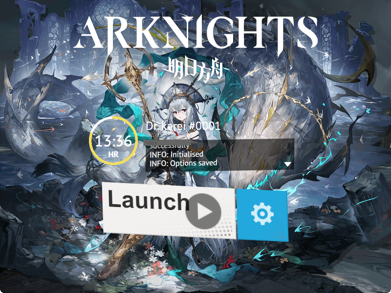
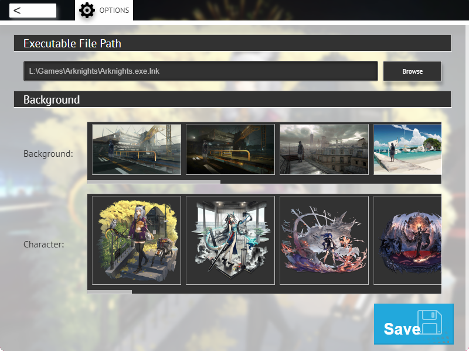
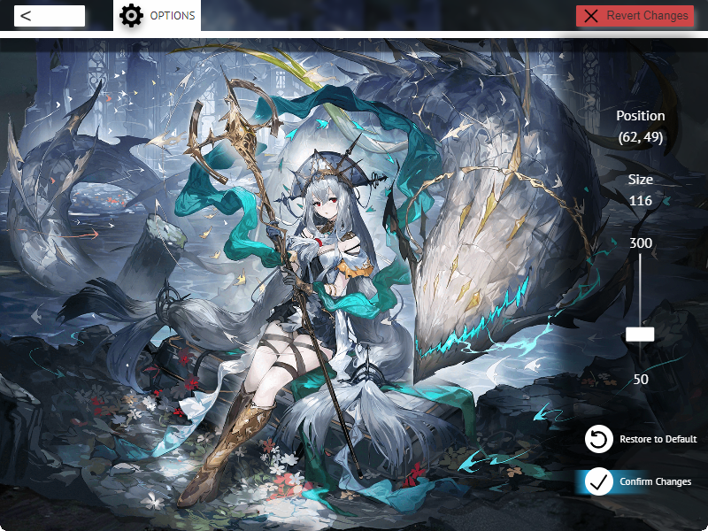

# Arknights Launcher

## Tauri application for launching Arknights on PC.  

## Features
* Rich presence on Discord
* Configurable launch file
* Create your own backgrounds by selecting a character and a background

* Position the character art  

<b>Icons from [icons8](https://icons8.com/)</b>

## Recommended IDE Setup

[VS Code](https://code.visualstudio.com/) + [Svelte](https://marketplace.visualstudio.com/items?itemName=svelte.svelte-vscode) + [Tauri](https://marketplace.visualstudio.com/items?itemName=tauri-apps.tauri-vscode) + [rust-analyzer](https://marketplace.visualstudio.com/items?itemName=rust-lang.rust-analyzer).
